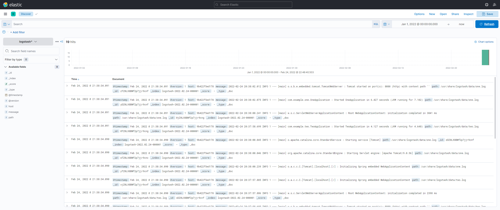
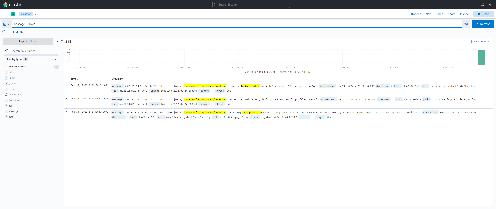

# Kibana

Example data for Kibana: [test-data.bulk.ndjson](test-data.bulk.ndjson)

Curl:
> curl -H "Content-Type:application/x-ndjson" -XPOST http://localhost:9200/_bulk --data-binary "@test-data.bulk.ndjson"

## Create Index Pattern

Management > Stack Management > Index Patterns > Create

- Choose a name.
    ```
    Examples:
    - access-logs*
    - logstash*
    ```
    *Where * is a wildcard.*


- Choose a timestamp field.

## Console

Management > Devtools

We can use the console to write queries and see the results. They are much easier to use than curl commands.

```
GET _search
{
  "query": {
    "match_all": {}
  }
}
```

```
GET _cluster/health
```

## Discover App

In the Discover app, we can find the documents for the index pattern we created.


We can query the documents using the query bar.


## KQL

Kibana Query Language is a powerful query language that is used to query Elasticsearch.
When we use the query bar in the Discover App, it is used to query our data.


---