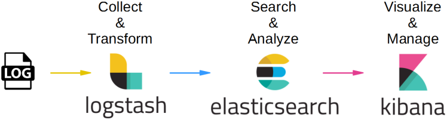
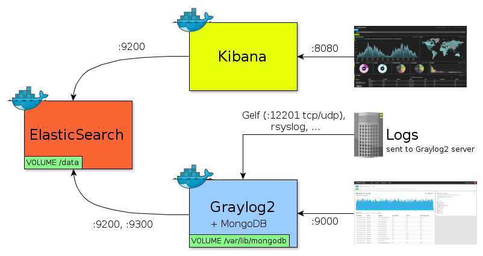

# LoggingProject
Testing Spring, ELK stack and docker configuration.

## Logs in Docker Container

We can use a docker command to get the logs of the container:
> docker logs -f ContainerName

## Physical Logs

Add to `application.properties`:
```
logging.file.path=log
```

To enter the container:
> docker exec -ti ONE /bin/sh

Print physical logs:
> cat workspace/log/spring.log

## Docker Volume

When using Maven to build the image:
> mvn spring-boot:build-image -v /path-to-host:/workspace/log

Or with Docker Compose:
```
volumes:
- /workspace
```

When running docker on WSL(2) you can find the volumes here:
> cd \\wsl$\docker-desktop-data\version-pack-data\community\docker\volumes

On Linux:
> cd /var/lib/docker/volumes/

Or in Docker Desktop in the Volumes tab. 

## Third Party Logging Services

The following stacks are often used to manage, aggregate and visualize a great amount of logs from different services.

### LogStash (ELK stack)



- Elasticsearch is a search and analytics engine:
- Logstash is a tool for managing logs.
- Kibana is a web application for visualizing and analyzing Elasticsearch data.

Some interesting qualities of this stack:
- RESTful
- Distributed
- Scalable
- Open Source
- Cloud-Native

The docker-compose in this repository is an example on how to set up the ELK stack.
Check [here](Kibana.md) for more information on Kibana.

### GrayLog (+MongoDB) & Elasticsearch & Kibana



Notice that Graylog needs an instance of MongoDB, where LogStash did not.

This is to store:
- Streams
- Alerts
- Users
- Settings
- Cached stream counts
- Everything else you see and edit in the web interface

*But not the logs!*

We can find an example setup [here](https://www.baeldung.com/graylog-with-spring-boot).